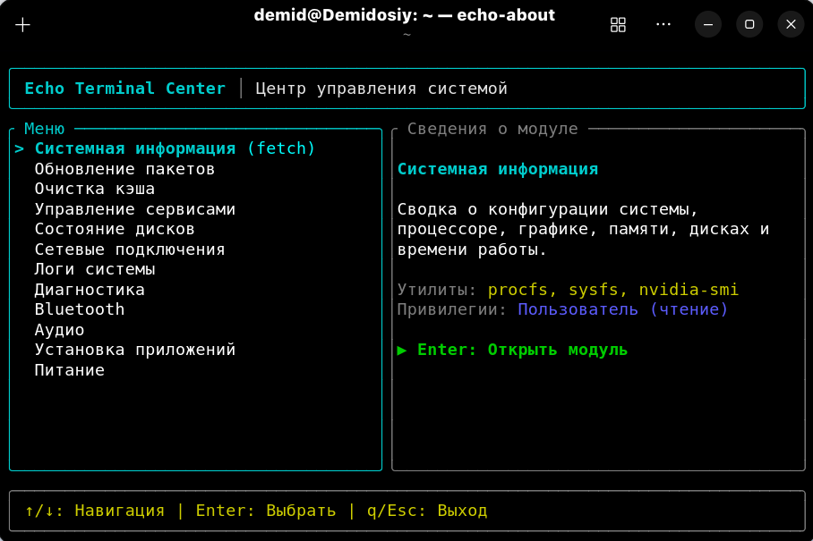
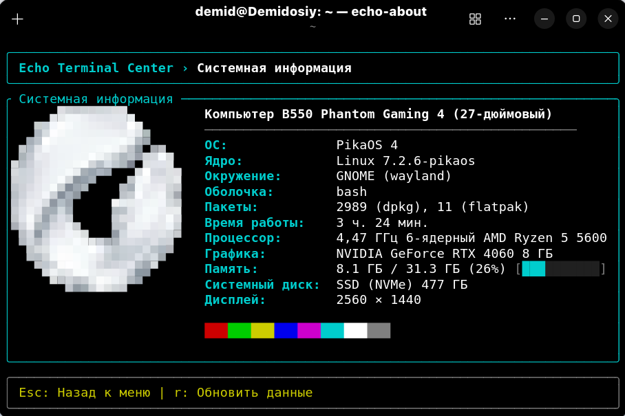

<p align="center">
  
</p>

<h1 align="center">Echo Terminal Center</h1>

<p align="center">
  <strong>Modern, keyboard-driven Linux system control center, hardware diagnostics suite, and fetch tool in your terminal.</strong>
</p>

<p align="center">
  <a href="https://github.com/dezaetterg/echo-terminal-center/releases"></a>
  <a href="LICENSE"></a>
  
  
</p>

<p align="center">
  <a href="#echo-terminal-center">English</a> •
  <a href="#echo-terminal-center-ru">Русский</a>
</p>

---

<p align="center">
  
  
</p>

---

## Echo Terminal Center

**Echo Terminal Center** brings together real-time hardware monitoring, system diagnostics, and everyday Linux administration into a single, lightning-fast terminal UI (TUI).

Built with Rust and [Ratatui](https://github.com/ratatui/ratatui), it reads directly from `/proc`, `/sys`, and system APIs without heavy background daemons. The application runs entirely as an unprivileged user, asking for `sudo` permissions only when executing actions that modify the system (such as package updates or service control).

### Features

#### Interactive TUI Modules
1. **System Information (`fetch`)**: Hardware overview, kernel version, CPU, GPU, memory, disks, and uptime with TrueColor ANSI logo.
2. **Package Updates**: Check and perform system updates across native package managers (`pacman`, `apt`, `dnf`) and `flatpak`.
3. **Cache Cleaner**: Analyze and reclaim disk space from package caches, systemd journal logs, and user thumbnail caches.
4. **Service Manager**: Inspect `systemd` units with instant restart and stop controls.
5. **Disk Health**: Filesystem usage breakdown and live SMART status monitoring.
6. **Network Connections**: Network interfaces, IP addresses, default gateways, and DNS configuration.
7. **System Logs**: View prioritized system error logs directly from `journalctl -p err`.
8. **Diagnostics**: Temperature sensors, kernel flags, swap memory usage, and AC power status.
9. **Bluetooth**: Adapter control, paired/connected devices list with battery levels, power toggle, and connect/disconnect.
10. **Audio Settings**: Input/output device overview, default sink/source selection, volume adjustment, and mute toggle.
11. **App Manager**: Search and install applications from system repositories or Flatpak, and uninstall existing apps.
12. **Power & Brightness**: Battery state, AC status, `powerprofilesctl` power profiles, and display brightness control.

#### Command-Line Modes (CLI)
- `echo-terminal`: Launch the interactive TUI application.
- `echo-terminal fetch`: Fast terminal system card with TrueColor logo (standalone fetch without TUI).
- `echo-terminal --json`: Export complete system metrics in structured JSON for automation scripts.
- `echo-terminal --short`: Print a concise single-line system summary.
- `echo-terminal --help`: Display command-line options and help.
- `echo-terminal --version`: Show program version.

---

#### Method 1: Automated Installer (Recommended)

Clone the repository and run the installer script:

```bash
git clone https://github.com/dezaetterg/echo-terminal-center.git
cd echo-terminal-center
chmod +x install.sh
./install.sh
```

- **Instant install**: Automatically downloads and installs the official optimized release binary without requiring compiler toolchains or `sudo`.
- **Compile option**: Pass `-b` or `--build` if you prefer to compile from source with Cargo (requires Rust 1.85+).
- **System integration**: Deploys `echo-terminal` to `~/.local/bin/` and registers desktop entry (`echo-terminal.desktop`) with high-resolution app icon.

#### Method 2: Official `.deb` Package (Linux Mint / Ubuntu / Debian)

Fastest setup for Debian-based distributions without cloning or compiling:

```bash
wget https://github.com/dezaetterg/echo-terminal-center/releases/download/v1.0.0/echo-terminal_1.0.0_amd64.deb
sudo dpkg -i echo-terminal_1.0.0_amd64.deb
```

#### Method 3: Pre-Built Release Tarball (`.tar.gz` or `.tar.zst`)

Download portable standalone binaries from [GitHub Releases](https://github.com/dezaetterg/echo-terminal-center/releases):

```bash
# Extract
tar -xzf echo-terminal-1.0.0-x86_64.tar.gz
# or
tar -I zstd -xvf echo-terminal-1.0.0-x86_64.tar.zst

# Install binary
install -Dm755 echo-terminal ~/.local/bin/echo-terminal
```

##### Verifying Checksums
```bash
sha256sum -c SHA256SUMS
```

#### Method 4: Build from Source with Cargo

Requires **Rust 1.85+** (install via [rustup](https://rustup.rs)):

```bash
git clone https://github.com/dezaetterg/echo-terminal-center.git
cd echo-terminal-center
cargo build --release
```

The compiled binary will be located at `target/release/echo-terminal`. Copy it to your PATH:

```bash
install -Dm755 target/release/echo-terminal ~/.local/bin/echo-terminal
```

> **Note**: Ensure `~/.local/bin` is in your shell `PATH`:
> ```bash
> export PATH="$HOME/.local/bin:$PATH"
> ```

---

### Keybindings

| Key | Context | Action |
|---|---|---|
| <kbd>↑</kbd> / <kbd>↓</kbd>, <kbd>k</kbd> / <kbd>j</kbd> | Main menu, lists | Navigate cursor |
| <kbd>Enter</kbd> | Main menu | Open selected module |
| <kbd>Esc</kbd> | Any screen | Return to main menu |
| <kbd>q</kbd> | Main menu | Quit application |
| <kbd>Ctrl+C</kbd> | Any screen | Force quit with terminal restoration |
| <kbd>r</kbd> | All modules | Refresh module data |
| <kbd>Enter</kbd>, <kbd>u</kbd> | Package Updates | Start system update |
| <kbd>Enter</kbd>, <kbd>c</kbd> | Cache Clean | Clean package cache |
| <kbd>r</kbd>, <kbd>s</kbd> | Service Manager | Restart (<kbd>r</kbd>) or stop (<kbd>s</kbd>) unit |
| <kbd>PageUp</kbd>, <kbd>PageDown</kbd> | System Logs | Scroll one page |
| <kbd>Home</kbd>, <kbd>End</kbd> | System Logs | Jump to beginning / end of logs |
| <kbd>p</kbd> | Bluetooth | Toggle adapter power on/off |
| <kbd>c</kbd>, <kbd>Enter</kbd> | Bluetooth | Connect / disconnect device |
| <kbd>Tab</kbd> | Audio, App Manager | Switch active tab |
| <kbd>Enter</kbd> | Audio | Set default output/input device |
| <kbd>+</kbd>, <kbd>=</kbd> / <kbd>-</kbd> | Audio | Increase / decrease volume by 5% |
| <kbd>m</kbd> | Audio | Toggle mute |
| <kbd>/</kbd> | App Manager | Search applications |
| <kbd>Enter</kbd>, <kbd>i</kbd> | App Manager (Search) | Install selected application |
| <kbd>Enter</kbd>, <kbd>d</kbd> | App Manager (Installed) | Uninstall selected application |
| <kbd>p</kbd>, <kbd>Enter</kbd> | Power & Brightness | Switch power profile |
| <kbd>+</kbd>, <kbd>=</kbd> / <kbd>-</kbd> | Power & Brightness | Adjust display brightness by 5% |
| <kbd>y</kbd> / <kbd>n</kbd> | Confirmation dialog | Confirm (<kbd>y</kbd>) or cancel (<kbd>n</kbd>) |

---

### Configuration & Localization

Echo Terminal Center requires no external configuration files. The interface language is detected automatically using your `LANG` environment variable:
- Values starting with `ru` (e.g. `ru_RU.UTF-8`) activate the **Russian** interface.
- All other locales (including `C`, `en_US.UTF-8`) use the **English** interface.

Minimum recommended terminal dimensions: **80×20** characters.

### System Dependencies

All external system tools are purely optional. If a tool is missing, Echo Terminal Center will gracefully indicate its unavailability rather than crashing:

- `pacman`, `apt`, `dnf`: Native package management.
- `flatpak`: Flatpak applications management.
- `systemd` / `journalctl`: Service inspection and system error logging.
- `pactl` / `wpctl`: PulseAudio / PipeWire audio control.
- `bluetoothctl`: Bluetooth controller and device operations.
- `smartctl`: SMART drive diagnostics.
- `powerprofilesctl`: Power performance profiles.
- `brightnessctl`: Screen backlight control.

---

<a id="echo-terminal-center-ru"></a>
## Echo Terminal Center (RU)

**Echo Terminal Center** объединяет мониторинг оборудования, системную диагностику и повседневные задачи администрирования Linux в едином клавиатурном TUI-интерфейсе.

Приложение написано на Rust с использованием [Ratatui](https://github.com/ratatui/ratatui) и обращается напрямую к `/proc`, `/sys` и системным интерфейсам без тяжелых фоновых демонов. Запускается от обычного пользователя и запрашивает права root через `sudo` исключительно для операций, изменяющих состояние системы.

### Возможности

#### Модули интерфейса (TUI)
1. **Системная информация (`fetch`)**: Сводка параметров оборудования, ядра, памяти и дисков с TrueColor ANSI логотипом.
2. **Обновление пакетов**: Проверка и установка обновлений через системный менеджер (`pacman`, `apt`, `dnf`) и `flatpak`.
3. **Очистка кэша**: Анализ и очистка кэша пакетов, системного журнала systemd и миниатюр.
4. **Управление сервисами**: Статус системных служб `systemd` с возможностью перезапуска и остановки.
5. **Состояние дисков**: Таблица файловых систем и опрос SMART-статуса накопителей.
6. **Сетевые подключения**: Сетевые интерфейсы, IP-адреса, шлюзы и DNS-серверы.
7. **Логи системы**: Просмотр журнала системных ошибок через `journalctl -p err`.
8. **Диагностика**: Датчики температуры, флаги ядра, использование swap и статус питания от сети.
9. **Bluetooth**: Состояние адаптера, список устройств с уровнем заряда, переключение питания и подключение.
10. **Аудио**: Входные и выходные устройства `pactl`/`wpctl`, выбор устройства по умолчанию, громкость и mute.
11. **Установка приложений**: Поиск и установка программ из репозиториев и Flatpak, удаление установленных пакетов.
12. **Питание**: Состояние батареи, переключение профилей `powerprofilesctl` и регулировка яркости дисплея.

#### Режимы командной строки (CLI)
- `echo-terminal`: Запуск интерактивного интерфейса TUI.
- `echo-terminal fetch`: Прямой вывод системной карточки с TrueColor логотипом в терминал без запуска TUI.
- `echo-terminal --json`: Экспорт метрик в формате JSON для скриптов автоматизации.
- `echo-terminal --short`: Краткая однострочная сводка основных параметров.
- `echo-terminal --help`: Справка по аргументам командной строки.
- `echo-terminal --version`: Версия программы.

---

### Установка

#### Способ 1: Автоматический установщик (Рекомендуется)

Клонируйте репозиторий и запустите скрипт установки:

```bash
git clone https://github.com/dezaetterg/echo-terminal-center.git
cd echo-terminal-center
chmod +x install.sh
./install.sh
```

- **Мгновенная установка**: Скрипт автоматически скачивает и устанавливает официальный нативный бинарник без необходимости компиляции, установки тулчейна Rust или прав `sudo`.
- **Сборка из исходников**: Если вы хотите собрать проект самостоятельно через Cargo, передайте флаг `-b` или `--build` (требуется Rust 1.85+).
- **Интеграция в систему**: Бинарник копируется в `~/.local/bin/echo-terminal`, создаётся ярлык приложения (`echo-terminal.desktop`) и устанавливается иконка высокого разрешения.

#### Способ 2: Официальный `.deb` пакет (Linux Mint / Ubuntu / Debian)

Самый быстрый способ установки для Debian-подобных систем без клонирования и компиляции:

```bash
wget https://github.com/dezaetterg/echo-terminal-center/releases/download/v1.0.0/echo-terminal_1.0.0_amd64.deb
sudo dpkg -i echo-terminal_1.0.0_amd64.deb
```

#### Способ 3: Готовые портативные архивы (`.tar.gz` или `.tar.zst`)

Скачайте релизный архив со страницы [GitHub Releases](https://github.com/dezaetterg/echo-terminal-center/releases):

```bash
# Распаковка
tar -xzf echo-terminal-1.0.0-x86_64.tar.gz
# или
tar -I zstd -xvf echo-terminal-1.0.0-x86_64.tar.zst

# Установка бинарника
install -Dm755 echo-terminal ~/.local/bin/echo-terminal
```

##### Проверка контрольных сумм:
```bash
sha256sum -c SHA256SUMS
```

#### Способ 4: Сборка из исходного кода через Cargo

Требуется **Rust 1.85+** (рекомендуется установка через [rustup](https://rustup.rs)):

```bash
git clone https://github.com/dezaetterg/echo-terminal-center.git
cd echo-terminal-center
cargo build --release
```

Скомпилированный файл будет находиться в `target/release/echo-terminal`. Скопируйте его в каталог из переменной PATH:

```bash
install -Dm755 target/release/echo-terminal ~/.local/bin/echo-terminal
```

> **Примечание**: Убедитесь, что каталог `~/.local/bin` включен в ваш `$PATH`:
> ```bash
> export PATH="$HOME/.local/bin:$PATH"
> ```

---

### Управление

| Клавиша | Контекст | Действие |
|---|---|---|
| <kbd>↑</kbd> / <kbd>↓</kbd>, <kbd>k</kbd> / <kbd>j</kbd> | Главное меню, списки | Перемещение курсора |
| <kbd>Enter</kbd> | Главное меню | Открытие выбранного модуля |
| <kbd>Esc</kbd> | Любой экран | Возврат в главное меню |
| <kbd>q</kbd> | Главное меню | Выход из приложения |
| <kbd>Ctrl+C</kbd> | Любой экран | Немедленный выход с корректным восстановлением терминала |
| <kbd>r</kbd> | Все модули | Обновление данных экрана |
| <kbd>Enter</kbd>, <kbd>u</kbd> | Обновление пакетов | Запуск обновления системы |
| <kbd>Enter</kbd>, <kbd>c</kbd> | Очистка кэша | Очистка кэша пакетов |
| <kbd>r</kbd>, <kbd>s</kbd> | Управление сервисами | Перезапуск (<kbd>r</kbd>) или остановка (<kbd>s</kbd>) службы |
| <kbd>PageUp</kbd>, <kbd>PageDown</kbd> | Логи системы | Прокрутка на страницу |
| <kbd>Home</kbd>, <kbd>End</kbd> | Логи системы | Переход в начало / конец журнала |
| <kbd>p</kbd> | Bluetooth | Включение / выключение адаптера |
| <kbd>c</kbd>, <kbd>Enter</kbd> | Bluetooth | Подключение / отключение устройства |
| <kbd>Tab</kbd> | Аудио, Установка приложений | Переключение вкладок |
| <kbd>Enter</kbd> | Аудио | Установка устройства по умолчанию |
| <kbd>+</kbd>, <kbd>=</kbd> / <kbd>-</kbd> | Аудио | Изменение громкости на 5% |
| <kbd>m</kbd> | Аудио | Включение / отключение звука (Mute) |
| <kbd>/</kbd> | Установка приложений | Ввод поискового запроса |
| <kbd>Enter</kbd>, <kbd>i</kbd> | Поиск приложений | Установка выбранного приложения |
| <kbd>Enter</kbd>, <kbd>d</kbd> | Удаление приложений | Удаление выбранного пакета |
| <kbd>p</kbd>, <kbd>Enter</kbd> | Питание | Переключение профиля энергопотребления |
| <kbd>+</kbd>, <kbd>=</kbd> / <kbd>-</kbd> | Питание | Изменение яркости дисплея на 5% |
| <kbd>y</kbd> / <kbd>n</kbd> | Окно подтверждения | Подтверждение (<kbd>y</kbd>) или отмена (<kbd>n</kbd>) |

---

### Конфигурация

Приложение не требует внешних конфигурационных файлов. Язык интерфейса определяется автоматически по переменной окружения `LANG`:
- Значения, начинающиеся с `ru` (например, `ru_RU.UTF-8`), включают русский интерфейс.
- Все остальные значения (включая `C` и `en_US.UTF-8`) используют английский язык интерфейса.

Минимальный рекомендуемый размер окна терминала составляет **80×20** символов.

### Системные зависимости

Все внешние системные утилиты являются опциональными. Если утилита отсутствует в системе, соответствующий блок корректно отображает статус недоступности:

- `pacman`, `apt`, `dnf`: управление системными пакетами.
- `flatpak`: управление приложениями Flatpak.
- `systemd` / `journalctl`: мониторинг служб и чтение логов.
- `pactl` / `wpctl`: управление звуковыми устройствами.
- `bluetoothctl`: опрос и управление Bluetooth.
- `smartctl`: чтение SMART-статуса накопителей.
- `powerprofilesctl`: переключение профилей энергопотребления.
- `brightnessctl`: регулировка яркости экрана.

---

## Лицензия

Проект распространяется под лицензией **GNU General Public License v3.0 or later (GPL-3.0-or-later)**.
Полный текст лицензии доступен в файле [LICENSE](LICENSE).
